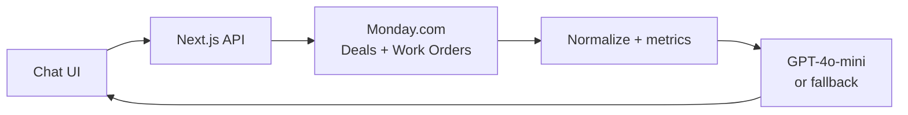

# Skylark BI Agent

A conversational business intelligence agent that answers founder-level questions by reading live data from **Monday.com** boards (Deals pipeline + Work Orders execution).

Built for the Skylark Drones full-stack assignment.

## Architecture flow



The UI calls backend API routes, which fetch live board data (cached 3 min), compute BI metrics, then return an LLM-generated or rule-based answer. Leadership updates use the same path via `/api/leadership`.

### Key modules

| Path | Purpose |
|------|---------|
| `app/page.tsx` | Chat UI with starter questions + leadership update button |
| `app/api/chat/route.ts` | Main agent endpoint |
| `app/api/leadership/route.ts` | Leadership briefing generator |
| `lib/monday/client.ts` | Monday.com GraphQL client (paginated, read-only) |
| `lib/data/load.ts` | Fetch + normalize messy board data |
| `lib/data/analytics.ts` | Pipeline, sector, revenue, ops metrics |
| `lib/agent.ts` | LLM orchestration + rule-based fallback |

## Monday.com setup

1. Import assignment CSVs as two boards:
   - **Deals** — sales pipeline
   - **Work Orders** — project execution
2. Create a **Personal API token**: Profile → Developers → API
3. Copy board IDs from the board URL: `monday.com/boards/<BOARD_ID>`

## Local setup

```bash
cd skylark-bi-agent
cp .env.example .env.local
# Edit .env.local with your tokens and board IDs
npm install
npm run dev
```

Open http://localhost:3000

### Environment variables

| Variable | Required | Description |
|----------|----------|-------------|
| `MONDAY_API_TOKEN` | Yes | Monday.com personal API token |
| `MONDAY_DEALS_BOARD_ID` | Yes | Deals board ID |
| `MONDAY_WORK_ORDERS_BOARD_ID` | Yes | Work Orders board ID |
| `OPENAI_API_KEY` | Recommended | Enables conversational AI answers |

Without `OPENAI_API_KEY`, the agent uses rule-based fallback answers (still reads live Monday data).

## Deploy (Vercel)

1. Push repo to GitHub
2. Import project in [Vercel](https://vercel.com)
3. Add the 4 environment variables above
4. Deploy — you'll get a public URL for submission

## Example questions

- "How's our pipeline looking for renewables this quarter?"
- "Which sectors have the most open deals?"
- "What's our total receivable from work orders?"
- "Compare pipeline vs execution in Mining"

## Data resilience

The agent handles messy real-world data by:
- Stripping CSV header artifacts (e.g. column names imported as values)
- Normalizing sector names (energy → Renewables)
- Tolerating missing dates, amounts, and sectors
- Surfacing data quality caveats with every answer

## Leadership updates

Click **Leadership update** in the UI (or `GET /api/leadership`) for a bullet-point executive briefing synthesized from both boards.

## Tech choices

- **Next.js 15** — fast to deploy, API routes + UI in one repo
- **Monday GraphQL API** — dynamic read-only access (no hardcoded CSV)
- **OpenAI GPT-4o-mini** — cost-effective query understanding
- **Vercel** — zero-config hosting for assignment deliverable

See `DECISION_LOG.md` for assumptions and trade-offs.
